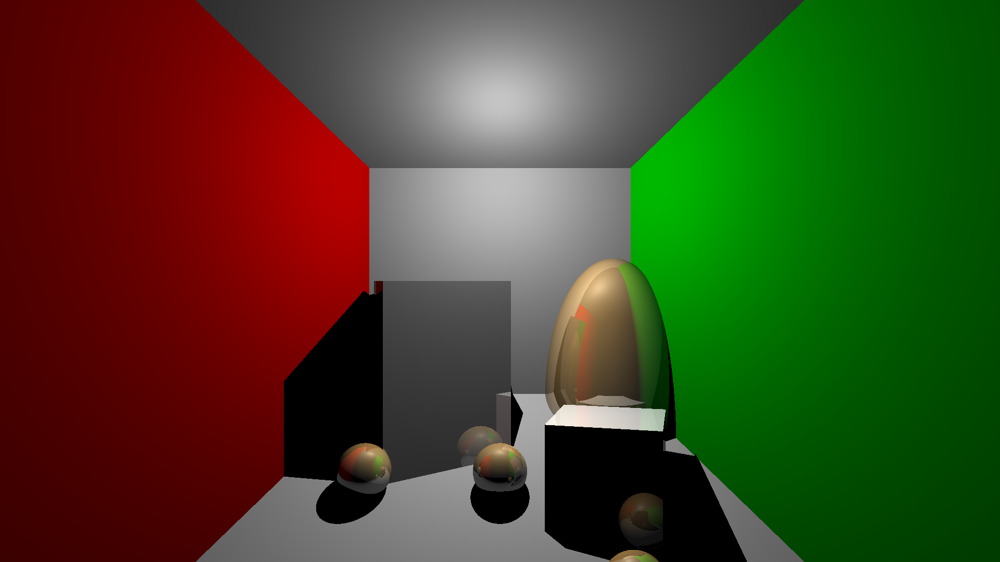

# Simple Raytracer

## About the Project

Final project of CSE167 at UCSD given by Albert Chern

A simple raytracer with 
* Phong shading to implement lighting and shadows
* Recursive ray tracing for mirror relections
* accelerated with openmp parallelization
* sphere and triangle primitives

## Usage

Windows executable in Releases

You can render predefined scenes by typing ` filename ` of the scene file into the command line.

## Images
rendered predefined scenes:
scene4.test, two transformed spheres and four spheres on a table

scene5.test, a thousand spheres

scene6.test, the Cornell box

scene7.test, the Stanford dragon

## Scene file useage
* `size width height`: image resolution
* `maxdepth depth`: The maximum depth for recursive ray
* `camera lookfromx lookfromy lookfromz lookatx lookaty lookatz upx upy upz fov`
* `sphere x y z radius`: Defnes a sphere with a given position and radius
* `maxverts number`: Defines a maximum number of vertices for later triangle specifications
* `vertex x y z`: Defines a vertex at the given location
* `tri v1 v2 v3`: Create a triangle out of the vertices involved
* `pushTransform`: Push the current modeling transform on the stack 
* `popTransform`: Pop the current transform from the stack
* `directional x y z r g b`: The direction to the light source, and the color
* `point x y z r g b`: The location of a point source and the color
* `attenuation const linear quadratic`: Sets the constant, linear and quadratic attenuations 
* `ambient r g b`: The global ambient color to be added for each object
* `diffuse r g b`: specifies the diffuse color of the surface
* `specular r g b`: specifies the specular color of the surface
* `shininess s`: specifies the shininess of the surface
* `emission r g b`: gives the emissive color of the surface

